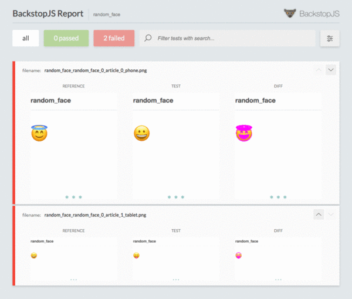

# backstop-retry-failed-scenarios

A wrapper command to retry failed scenario for [BackstopJS](https://github.com/garris/BackstopJS).<br>
It parses report.json, extract failed tests, and rerun with `--filter` option, and rewrite result file.<br>
This is useful when your tests are unstable.

# FEATURES
- Invoke specified test command
- Generate filter option from failed tests
- Reorganize each failed reports to latest one status
  - Supports HTML report, JSON report, CI report.

## EXAMPLE

This endpoint returns random emoji from three emojis(😀, 😇, 😝).<br>
Each try may fail, but retrying failed tests will pass all test.
- https://blog.sushi.money/random_face

```
$ cd examples/retry
$ backstop reference
$ npx backstop-retry-failed-scenarios
```




## HOW TO RUN
Instead of `backstop test`, run `backstop-retry-failed-scenarios` and set command, retry count, config path.

```
$ npm install -g backstop backstop-retry-failed-scenarios
$ backstop init
$ backstop reference
$ backstop-retry-failed-scenarios --retry 5 --command 'backstop test' --config backstop.js
```

Also you can run BackstopJS on docker, like this.

```
$ npm install -g backstop-retry-failed-scenarios
$ docker run --rm -v $(pwd):/src backstopjs/backstopjs init
$ docker run --rm -v $(pwd):/src backstopjs/backstopjs reference
$ backstop-retry-failed-scenarios --retry 5 --command 'docker run --rm -v $(pwd):/src backstopjs/backstopjs test'
```

## OPTIONS

```
  --retry number     Retry count. default: 3
  --config string    Path to config file. default: backstop.json
  --command string   Command to run test. default: backstop test
```